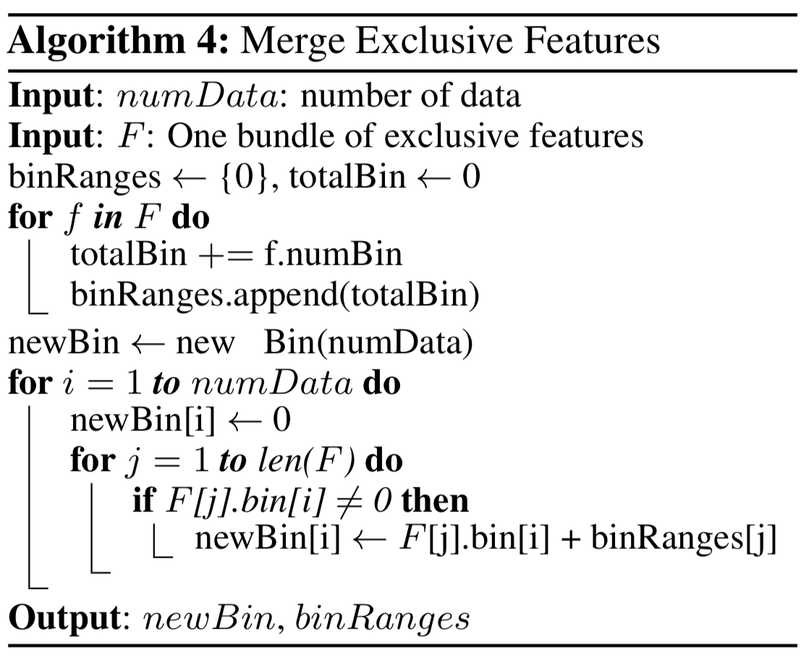

LightGBM是微软开源的一个GBDT算法的高效实现库，在XGBoost的基础上进行改良，在训练效果接近的情况下，运行速度相比XGBoost有大幅提升。

在GBDT算法中，最消耗时间的步骤是寻找决策树的切分点。传统GBDT算法使用预排序（pre-sorted）算法，将特征值排序，遍历所有可能的切分点，如果有n个特征，m个样本，这样做的时间复杂度为O(mn)。

除了预排序算法，XGBoost还支持直方图（histogram）算法，将数据按特征值划分，用一个个桶（bin）储存，切分点的可能选择为桶的划分点。如果有k个桶，则时间复杂度为O(kn)，k << m。

### Gradient-based One Side Sampling
LightGBM在直方图算法的基础上，提出了Gradient-based One Side Sampling（GOSS），目的是减少寻找切分点时需要的样本数，从而降低算法的时间复杂度。

对目标函数二阶泰勒展开后，每个样本会有梯度。GOSS算法选择一个阈值，选取所有梯度大于阈值的样本，随机采样部分梯度小于阈值的样本，组成一个子集，在计算切分增益时只考虑上述子集中的样本。[LightGBM论文]()中提供了详细的数学证明。

### Exclusive Feature Bundling
LightGBM还提出了Exclusive Feature Bundling（EFB），用来减少切分点选择时要遍历的特征数。实际应用中，高维的数据往往是稀疏的，比如有些特征几乎不会同时取非零值，可以把这样的特征可以组合成一个bundle，选择切分点时，只需要遍历各个bundle。

LightGBM证明了寻找这样的feature bundle的问题可以由图着色问题（graph color problem）退化而来。一组bundle feature相当于图着色问题中一组相同颜色的节点。此问题是NP-hard，因此用贪心算法近似求解。

对于一组bundle features，LightGBM提出一种merge算法，将bundle组成一个feature，核心思想是通过加offset使每个feature的取值范围不相交。

### 决策树生成方式
XGBoost采用level-wise的分裂方法，生成的决策树是满二叉树，即每一层的每个节点都需要分裂，增益较小的节点也会分裂。

LightGBM采用Leaf-wise的分裂方法，考虑所有叶子节点(不同层)，选择增益最大的进行分裂。这样做很容易使决策树很深，陷入过拟合。因此LightGBM也提供了max_depth参数来控制最大层数。
