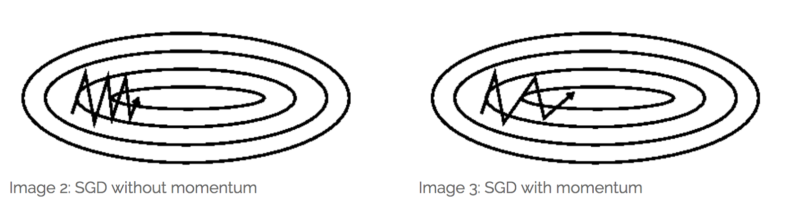
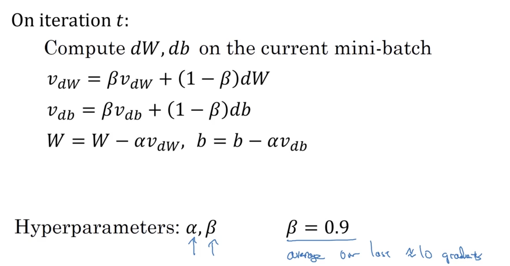

### 梯度下降
梯度下降（Gradient Descent）是深度学习中最常见的优化方法。每一步计算损失函数对参数的梯度，然后沿着梯度的负方向更新参数。$$\Theta = \Theta -\alpha \cdot \triangledown_\Theta J(\Theta )$$直观上就是从最陡峭的方向下山。

使用梯度下降算法时，如果选用所有数据计算梯度，计算量太大，如果随机选择单个训练数据计算，则迭代次数会非常大。实际应用中，会选择一个适当的batch size（16-512）来计算梯度。

当目标函数为凸函数时，梯度下降的解是全局最优解。一般情况下，不能保证是全局最优解。
### Momentum
梯度下降只考虑了当前的梯度，Momentum算法使用指数加权平均，把之前的历史梯度和当前梯度融合，确定最终的梯度方向。这样做有平均的效果，错误的梯度方向往往是随机的，通过平均可以消除这样的梯度分量，能够更快收敛，并有一定摆脱局部最优的能力。

Momentum具体算法：

两个超参数$\alpha$和$\beta$分别表示学习率和加权平均系数。

### Adagrad
Momentum和梯度下降算法中学习率始终不变，Adagrad算法可以根据梯度调整学习率。算法如下：

1. 首先计算出梯度g
2. 计算 $\boldsymbol{s} \leftarrow \boldsymbol{s} + \boldsymbol{g} \odot \boldsymbol{g}.$ s初始化为0
3. 调整学习率 $\boldsymbol{g}^\prime \leftarrow \frac{\eta}{\sqrt{\boldsymbol{s} + \epsilon}} \odot \boldsymbol{g},$
4. 更新 $\boldsymbol{x} \leftarrow \boldsymbol{x} - \boldsymbol{g}^\prime.$

从公式中可以看到，基础学习率为$\eta$，如果梯度在某个方向下降很快，即某个分量很大，则变量s中相应的分量也大，导致这个方向的学习率下降很快，防止跳过最优解。

### RMSProp
RMSProp是Adagrad和momentum的结合。在Adagrad的基础上，考虑历史梯度，加入momentum算法中的指数加权平均。实际应用中，RMSProp优于Adagrad。

1. $\boldsymbol{s} \leftarrow \gamma \boldsymbol{s} + (1 - \gamma) \boldsymbol{g} \odot \boldsymbol{g}.$
2. $\boldsymbol{g}^\prime \leftarrow \frac{\eta}{\sqrt{\boldsymbol{s} + \epsilon}} \odot \boldsymbol{g},$
3. $\boldsymbol{x} \leftarrow \boldsymbol{x} - \boldsymbol{g}^\prime.$

Adagrad和RMSProp都是根据梯度的平方（大小）来调整每个分量上的学习率。

### Adam
Adam算法结合了momentum和RMSProp，是目前最好的优化算法之一。

1. 与momentum类似计算 
2. 与RMSProp类似计算 
3. 修正误差，使过去各时刻的权重$\beta^t$和为1. $\hat{\boldsymbol{v}}_t \leftarrow \frac{\boldsymbol{v}_t}{1 - \beta_1^t},$, $\hat{\boldsymbol{s}}_t \leftarrow \frac{\boldsymbol{s}_t}{1 - \beta_2^t}.$
4. 得到最终梯度 $\boldsymbol{g}_t^\prime \leftarrow \frac{\eta \hat{\boldsymbol{v}}_t}{\sqrt{\hat{\boldsymbol{s}}_t + \epsilon}},$
5. 更新 

### 牛顿法、拟牛顿法
牛顿法和拟牛顿法是另一类求解优化问题的算法。如果目标函数二次可微，函数f(x)取极小值的必要条件是导数$f\prime(x)=0$，对f(x)泰勒二次展开，得到=f%5Cleft&space;(&space;x_k&space;%5Cright&space;)+%7Bf%7D%27%5Cleft&space;(&space;x_k&space;%5Cright&space;)%5Cleft&space;(&space;x-x_k&space;%5Cright&space;)+%5Cfrac%7B1%7D%7B2%7D%7Bf%7D%27%27%5Cleft&space;(&space;x_k&space;%5Cright&space;)%5Cleft&space;(&space;x-x_k&space;%5Cright&space;)%5E2)

求导并令其等于0，得到:

+%7Bf%7D%27%27%5Cleft&space;(&space;x_k&space;%5Cright&space;)%5Cleft&space;(&space;x-x_k&space;%5Cright&space;)=0)

解得:

%7D%7B%7Bf%7D%27%27%5Cleft&space;(&space;x_k&space;%5Cright&space;)%7D)

扩展到高维情况，一阶导数用梯度代替，二阶导数的倒数用Hessian矩阵的逆矩阵代替。牛顿法要收敛，Hessian矩阵必须正定。牛顿法利用了二阶偏导数，其收敛速度比梯度下降类算法快，但是求Hessian逆矩阵的计算量往往非常大，因此出现[拟牛顿法](https://zh.wikipedia.org/wiki/%E6%93%AC%E7%89%9B%E9%A0%93%E6%B3%95)，近似计算Hessian逆矩阵，如DFP算法、BFGS算法等。

### 启发式算法
遗产算法、粒子群算法等启发式算法（Heuristic Algorithm）也可以解优化问题。启发式算法往往是模拟自然界生物的行为，在可接受的计算成本内取搜索最优解，但不一定保证收敛。

以遗传算法为例，在解空间内随机生成一组解，作为初始种群。种群之间进行交叉、变异，产生新的一组解。选择一个适应度函数来评价解的优劣，按概率进行选择。如果第i个个体的适应度函数为$f(x_i)$,则它被选择到下一个种群的概率为$\frac {f(x_i)}{\sum_{n=1}^N f(x_n)}$。如此不断迭代直到收敛。

目标函数$f(x)=x^2$求最小值，可以令适应度函数为$\frac 1 {x^2}$。考虑两个二进制数[1000,1110], 交叉操作可以将后两位交换，生成[1010,1100]; 变异操作可以将任意一位取反，以最后一位为例，则生成[1001,1111]。
