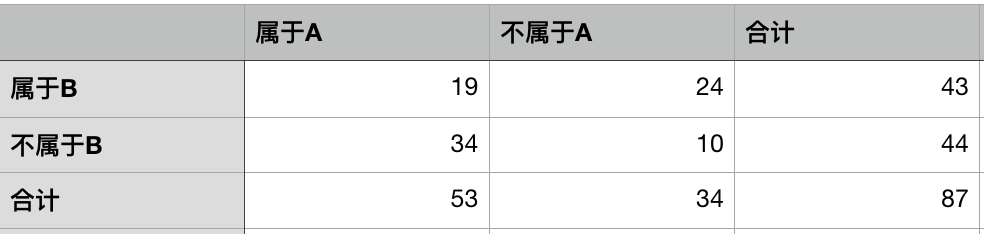

## 特征选择
从已有的特征中选择出有意义的特征，提升模型表现、减少计算量。

特征选择的主要方法：

* 方差选择
* 相关系数
* 卡方检验
* 互信息
* 递归特征消除：Recursive Feature Elimination（RFE）
* 基于L1正则化
* 基于树模型

### 方差选择
对每个特征计算方差，设定阈值（或特征个数）并筛选。特征的方差小，说明样本在这个特征上没什么差异，这个特征没有区分能力，因此可以通过方差来选择特征。

### 相关系数
皮尔逊相关系数  

衡量两个变量的相关程度，取值为[-1,1]，绝对值越大表示两者越相关。变量与自身的相关系数为1。

可以计算所有特征与目标值的相关系数，设定阈值并筛选出与目标值较为相关的特征。

### 卡方检验
卡方检验用来验证两个变量是否相关，原假设两者不相关。
卡方检验统计量的计算公式： $$\chi^2 = \sum \frac{(A-T)^2}{T}$$ A表示实际值，T表示理论值，对所有可能求和。

两个变量A、B可以做出四格表
计算出属于A的概率为0.609

最终计算卡方统计量 $\chi^2 = \frac{(19-26.2)^2}{26.2} +  \frac{(34-26.8)^2}{26.8} + \frac{(24-16.8)^2}{16.8} + \frac{(10-17.2)^2}{17.2} = 10.00$

卡方统计量的值越大，说明理论和实际的差别越大，拒绝原假设，说明两个变量越相关。

特征选择时，选择与目标值卡方统计量较大的特征。卡方检验在基于词袋模型的文本分类时，特征选择效果较好。

### 互信息
互信息的定义 


也可以表示为


直观的解释：原来对X的不确定性为熵H(x)，知道Y之后对X的不确定性为条件熵H(X|Y)，不确定性的减少量$H(x)-H(X|Y)$就是X、Y之间的互信息。

互信息表示了两个变量的关联程度，越大表示越相关，因此可以计算特征与目标量之间的互信息，据此筛选特征。

### 递归特征消除
Recursive Feature Elimination（RFE），直接使用最终的模型，递归训练模型，每次根据模型中的特征重要性，不断删除最不重要的特征。这里的模型需要训练完后能提供特征的权重。

sklearn中实现了这个算法，配合可以提供feature_importance的模型很方便。

```
>>> from sklearn.datasets import make_friedman1
>>> from sklearn.feature_selection import RFE
>>> from sklearn.svm import SVR
>>> X, y = make_friedman1(n_samples=50, n_features=10, random_state=0) #一共10个特征
>>> estimator = SVR(kernel="linear") #用SVM模型
>>> selector = RFE(estimator, 5, step=1) #选择5个特征，每次递归删除一个
>>> selector = selector.fit(X, y)
>>> selector.support_ 
array([ True,  True,  True,  True,  True,
        False, False, False, False, False], dtype=bool)
>>> selector.ranking_
array([1, 1, 1, 1, 1, 6, 4, 3, 2, 5])
```

### 基于L1正则化
带L1正则化的线性模型容易获得稀疏解，[目标函数与L1取值范围的交点往往在坐标轴上]()，不为零的系数所对应的特征即是最重要的特征。

使用线性模型（线性回归、逻辑回归、线性支持向量机），配合L1正则化，拟合训练数据，非零系数对应的即为重要特征。通过控制正则化系数C，可以控制选择的特征多少。

```
>>> from sklearn.svm import LinearSVC
>>> from sklearn.datasets import load_iris
>>> from sklearn.feature_selection import SelectFromModel
>>> iris = load_iris()
>>> X, y = iris.data, iris.target
>>> X.shape
(150, 4)
>>> lsvc = LinearSVC(C=0.01, penalty="l1", dual=False).fit(X, y) 
>>> model = SelectFromModel(lsvc, prefit=True) # 用线性支持向量机和L1正则化选取特征
>>> X_new = model.transform(X)
>>> X_new.shape
(150, 3)
```

### 基于树模型
决策树构建时，每一个节点分裂的过程就是寻找增益最大的特征。单颗树容易过拟合，结合随机森林或GBDT这样的集成学习模型，计算特征在所有决策树模型上的平均增益，能够很好的反映一个特征的有效性。

```
>>> from sklearn.ensemble import ExtraTreesClassifier
>>> from sklearn.datasets import load_iris
>>> from sklearn.feature_selection import SelectFromModel
>>> iris = load_iris()
>>> X, y = iris.data, iris.target
>>> X.shape
(150, 4)
>>> clf = ExtraTreesClassifier()
>>> clf = clf.fit(X, y)
>>> clf.feature_importances_  
array([ 0.04...,  0.05...,  0.4...,  0.4...])
>>> model = SelectFromModel(clf, prefit=True)
>>> X_new = model.transform(X)
>>> X_new.shape               
(150, 2)
```