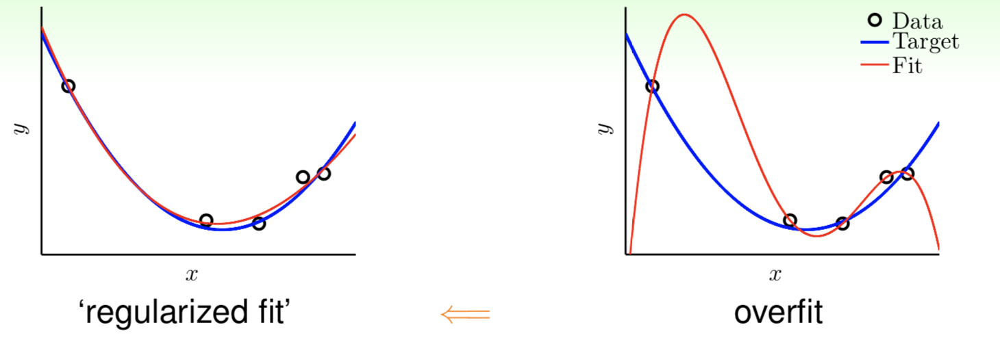
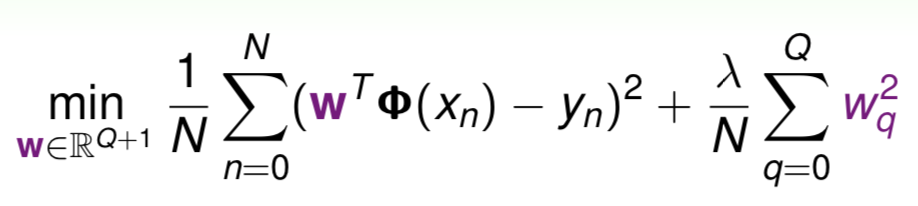

### 过拟合
模型在训练数据上表现好，而在测试数据上表现不好的现象称为过拟合。从方差和偏差的角度，过拟合时偏差小但是方差大。

### L0、L1、L2正则化

正则化目的在于防止过拟合，以上图为例，二次函数能较好的拟合现有数据点，三次函数也可以拟合现有的数据点，也就是说它们都能使训练误差很小。但是对于新的数据点，三次函数的测试集误差就会很大，因此三次函数模型在这里就是过拟合。

一个数据集可以有许多模型能使其训练误差很小，模型越复杂，越有可能出现过拟合。一般来说，n次多项式模型的参数可以表示成$[w_0, w_1, w_2, ..., w_n]$，如果只有$w_0, w_1, w_2$不为0，则n次多项式模型退化成二次函数。

* L0正则化：限制$w_i$不为0的个数
* L1正则化（Lasso）：限制$\sum_{i=0}^{n}|w_i| \le C$
* L2正则化（Ridge）：限制$\sum_{i=0}^{n}|w_i|^2 \le C$

L0正则化可以使参数稀疏化，控制模型的复杂度，但是这样求解参数向量W是NP-hard的问题，因此实际不使用L0正则化。L1和L2正则化如上图所示，参数取值范围被限制（二维情况下L1对应正方形，L2对应圆形），找到与损失函数的等高线首次相交的点，就是最优解。损失函数加上正则化项后作为目标函数，绝对值函数和平方函数都是凸函数，因此可以用最优化方法来求解参数向量W。下式也称为权值衰减（weight-decay）

如果是L1正则化，相交的点往往会趋向于顶点（斜边上点的法向量不指向损失函数圆心），从而导致许多w的取值为0，形成稀疏解。所以L1正则化也可以用于特征选择。

如果是L2正则化，则损失函数处处可微，优化求解稳定且快速，最终的参数大多数为非零，且相对较小。实际使用效果L2正则化优于L1正则化。

### Dropout

在神经网络的训练阶段，随机丢弃某些神经元，每个batch训练时对应的神经网络都不同。Dropout的好处：

* 减少计算量
* 使特征随机组合，防止过拟合

### Early Stopping

随着训练次数的增加，模型的偏差减小，而方差增大，在某个临界点后就出现了过拟合。Early Stopping是在测试集误差逐渐增大后，提前停止训练，从而防止过拟合。

### Data Augmentation
从数据的角度，过拟合可能由数据量太少而造成。如果能获得更多的训练数据，有助于防止过拟合。在无法获得更多数据的情况下，可以在现有数据的基础上随机生成更多的数据，即数据增强。

常用的数据增强方法有：平移、旋转、翻转等。

在类别不平衡的情况下，可以利用数据增强重复采样，使最终的训练数据类别平衡。