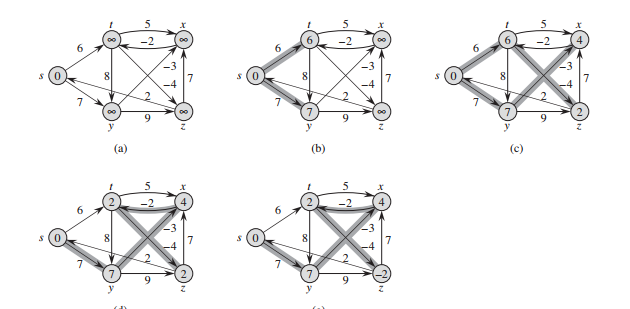

# 图的表示 #
稀疏图使用邻接链表，稠密图使用邻接矩阵，无向图的邻接矩阵的转置是其本身

链表的数据结构 
```java
	class LinkNode {
		LinkNode next;
		Integer val;
		String color;	
		LinkNode(Integer val) {
			this.val = val;
		}
	}
```
邻接链表的优点是可以以`O(V+E)`的空间复杂度存储图的信息，但是如果想要判断两个节点之间是否存在路径则需要遍历其中的一个子链表
而邻接矩阵则是以一个二维数组存储，如果i节点和j节点之间存在路径，则`array[i][j]`的值是1或路径的权重

# 图的搜索 #
## 广度优先搜索 ##
基本思想是，以节点颜色标识此节点是否被处理过，白色表示未被访问过，灰色表示被访问过，黑色表示此节点的所有邻接节点都被访问过。
算法的执行过程为，首先将图中的所有节点都置为白色，将源节点置为灰色，然后将源节点推入队列中；在队列不为空的情况下，循环出队，并将当前出队的节点的所有为白色的邻接节点置为灰色（被发现），之后将出队的节点置为灰色。二叉树的层级遍历就是图的广度优先搜索。

```java
     public void BFS(LinkNode[] G, LinkNode s) {
        for (LinkNode node : G) {
            node.color = "WHITE";
        }

        s.color = "GREY";

        Queue<LinkNode> queue = new LinkedList<>();
        queue.add(s);

        while (queue.size() > 0) {
            LinkNode u = queue.poll();
            LinkNode temp = u.next;
            while (temp != null) {
                if (G[temp.val].color == "WHITE") {
                    queue.add(G[temp.val]);
                    temp = temp.next;
                }
            }
            u.color = "BLACK";
        }

    }
```
以上代码假设图中的节点为连续的数字，如果是其他情况，可以使用Map表示节点与其邻接链表之间的映射。

## 深度优先搜索 ##
深度优先搜索的基本思想是以递归的方式逐层深入图的非黑最底部，将底部节点置为黑色，之后回到上一层，再次深入非黑节点。代码如下

```java
    public void DFS(LinkNode[] G){
        for (LinkNode node : G) {
            node.color = "WHITE";
        }

        for(LinkNode u: G){
           if("WHITE".equals(u.color)){
               DFS_VISIT(G, u);
           }
        }
    }


    public void DFS_VISIT(LinkNode [] G, LinkNode u){
        u.color = "GREY";
        LinkNode temp = u.next;
        while(temp != null){
            if("WHITE".equals(temp.color)){
                DFS_VISIT(G, G[temp.val]);
            }
        }
        u.color = "BLACK";
    }
```

同上假设图中节点为连续数字

## 图的拓扑排序 ##

图的拓扑排序是将图的所有节点在一条水平线上展开，图中的所有有向边都从左指向右。假设我们将图的拓扑排序存储在一个链表中，可以通在DFS算法中加入一个节点处理完成时间标识，在每一个节点完成后，将其插入链表的顶部。结果链表就是这个图的拓扑排序。

## 强连通分量 ##
对于有向图G=(V,E)来说，他的一个强联通分量是一个最大节点集合C属于V，对于C中任意一对节点u和v来说，路径v~u和路径v~u同时存在。
求解强连通分量的方法是
    
    1. 对图进行DFS，并记录每个节点结束的时间
    2. 对图进行转置（所有的边反向）
    3. 按照第一步记录时间的递减顺序（即拓扑排序）再次进行DFS，此次得到的DFS森林即G的强连通分量
可以简单的证明这个方法的正确性。对于强联通分量C，其转置仍然是一个强连通分量，对于G，假设有两个强联通分量C1和C2且存在一条边使得C1-C2连通，但C2-C1不连通。在进行DFS过程中，如果先访问到C1，则C2的所有节点都是C1中节点的子节点，其完成时间将早于C1中的所有节点，在进行转置后的DFS过程中，由于C1-C2不连通，所以C1将会变成一棵单独的树。而如果在DFS过程中首先访问的是C2，由于C2-C1不连通，所以C2的完成时间一定早于C1，同前述论证。


## 单源最短路径 ##
在介绍单源最短路径算法之前，先介绍一下松弛操作。对于每一个几点来说，我们维持一个属性v.d用来记录源节点s到节点v的最短路径的上界（即最短路径不会超过这个值）。我们称v.d为s到v的最短路径估计。对一条边`(u,v)`的松弛过程为判断`u.d + w(u,v)`（其中w(u,v)为uv两节点之间边的长度）与当前v.d的大小关系，如果更小，则更新v.d

```java
    RELAX(u,v w){
	    if(v.d > u.d + w(u,v)){
	        v.d = u.d + w(u,v)
	    }
	}
```
### Bellman-Ford算法 ###
此算法解决的是一般情况下的单源最短路径问题，一般情况是指边的权重可以为负值。我们假设图中没有值为负值的环。
此算法通过对边进行松弛操作来渐进的降低从源节点s到每个节点v的最短路径。
初始状态s.d为0，其他任意节点v.d为无穷大。从源节点开始，对行进中节点的相关的每条边进行松弛操作。

	

